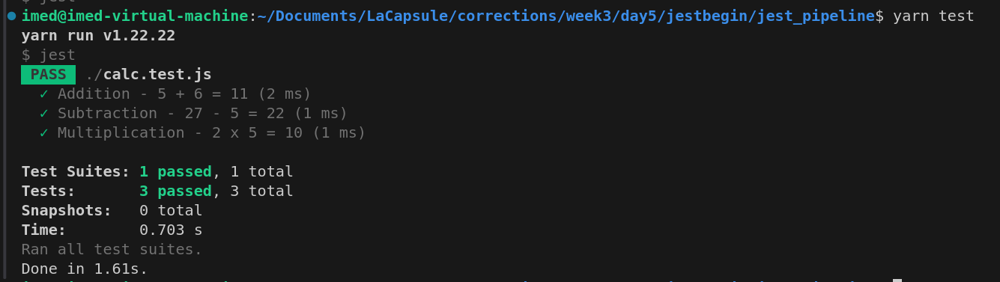
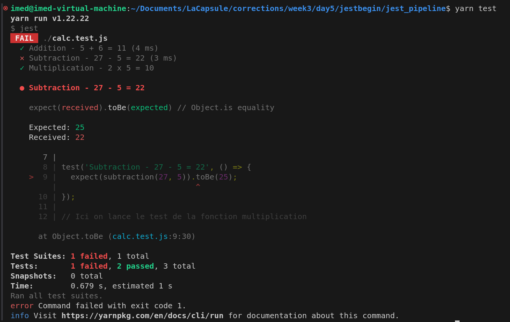

# JEST
Jest est un outil qui va nous permettre de mettre en place les tests. C'est un framework axé test et il est utilisé pour les projets node.js.

## Installation 
Pour installer jest, il faut d'abord se situer dans le prjet node.js dans lequel on veut effectuer nos tests.
On peut soit utiliser yarn soit npm pour installer jest
```bash
# yarn
yarn add --dev jest
```

```bash
# npm
npm install --save-dev jest
```

## Utilisation de JEST

Pour créer un fichier de test avec jest, par convention on va nommer nos fichiers de tests par le nom du fichier qu'on veut tester avec l'extension `.test.js`.
Par exemple si on a un fichier `calc.js` qu'on veut tester, alors on va créer le fichier de test `calc.test.js`.

Exemple :
```js
// Fichier calc.js
function addition(a, b) {
  return a + b;
}
```

```js
// Fichier calc.test.js
// Ici on importe le fichier calc.js
const { addition, subtraction, multiplication } = require('./calc');

// Ici on test la fonction addition du fichier calc.js
test('Addition - 5 + 6 = 11', () => {
  // Ici on lance le test, on dit qu'on s'attend a ce que la fonction addition retourne 11 quand on lui donne 5 et 6 en parametre (5 + 6 = 11)
  expect(addition(5, 6)).toBe(11);
});
```
Ensuite pour tester nos fichiers de tests, on lance la commande :
```bash
yarn test
```

Si tout s'est bien passé alors ca s'affichera dans les logs, sinon ca s'affichera dans les logs avec l'endroit exact ou le ou les tests ont échoués

### Quand ça se passe bien

Comme vous pouvez le voir, 3 tests sont bien passés.

### Quand ça se passe mal

Comme vous pouvez le voir, 1 des 3 tests n'est pas passé.

## Envoie sur la pipeline de gitlab

Une fois que le projet est hebergé sur un repo Gitlab, on va créer un fichier nommé `.gitlab-ci.yml`.
C'est dans ce fichier qu'on va y mettre le script qui va s'executer dans Gitlab.

Voilà le rendu final du fichiers .gitlab-ci.yml :
```yml
# Ici l'image docker => on dit que ce script dépend de node avec la version 18
image: node:18

# Ici on définit nos étapes et on peut nommer nos étapes comme on veut (ici qu'une seule étape = test)
stages:
  - test

# Ici c'est la ou la pipleine va lancer nos stages
check_test:
  stage: test # Ici on dit que l'étape nommé test (définit un peu plus haut) peut commencer
  script: # Ici on écrit le code de ce que l'étape test doit faire
    - npm install # On installe les dépendances de notre projet via npm 
    - yarn test # On lance les test grâce à jest
```