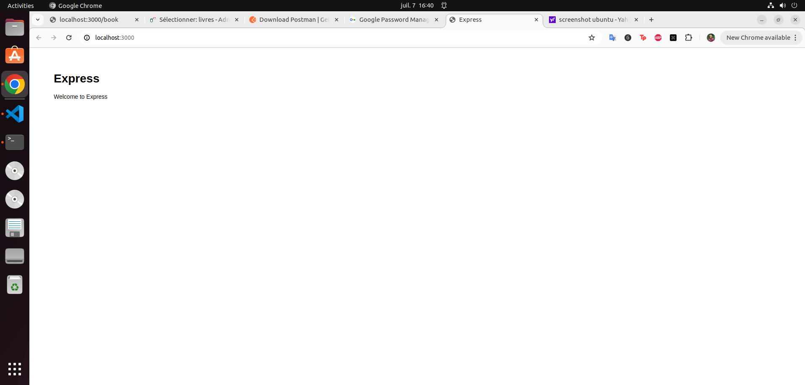

# Hackathon 1

## 1. Initialisation du projet

Ici on nous demande d'initialser le projet dans 2 repository Gitlab :
- Le Frontend dans l'un
- Le Backend dans l'autre

### 1ere étape : Cloner les repos

On clone les repo du frontend et backend :
```bash
# Frontend
git clone http://192.168.2.28/hackathon2/frontend.git
# Backend
git clone http://192.168.2.28/hackathon2/backend.git
```

### 2eme étape : Supprimer le lien avec le dépôt distant original et hébergez le projet sur notre propre repo GitLab

On commence par frontend :
```bash
cd frontend
git remote remove origin
git remote add origin git@gitlab.com:imed92/frontend_lacapsule.git
git push 
``` 
Puis on fait pareil sur backend
```bash
cd ../backend
git remote remove origin
git remote add origin git@gitlab.com:imed92/backend_lacapsule.git
git push 
``` 
Maintenant on check si c'est bien push sur Gitlab


Et voilà, c'est bien push sur nos repos distant

## 2. Configuration du projet
On va maintenant configurer notre projet
On rentre dans notre projet backend puis on liste nos branches

```bash
cd backend/
git branch
# On a que la branche main
* main
```

On a que la branche main, on va donc en créer 1 autre: preprod
```bash
git checkout -b prod
```
Puis on envoie cette branche sur le serveur distant
```bash
git push --set-upstream origin prod
```
On check via gitlab et :


Une fois que c'est fait on rebascule sur main
```bash
git checkout -b main
```

On va maintenant se créer un serveur de base de données via le service MongoAtlas .
Voir ici comment faire :
Site de MongoAtlas : https://www.mongodb.com/atlas/database
Tuto comment créer sa bdd : https://drive.google.com/file/d/1fd8dN2LMvfxvjn8cqWoowVsz2wn7AZbs/view?usp%3Dsharing
Tuto remplir : https://drive.google.com/file/d/1QCH7Loa1tgZgErgFQWH3nFmHjAHtpmQN/view?usp%3Dsharing
Pour remplir sa base de données, il faut la remplir avec le contenu du fichier trips.json dans ce repo meme.

Pour mettre en place la connexion depuis MongoDB Compass, il faut renseigner l'url avec le password de son cluster MongoDB 
Ensuite, on créer la base de données nommé lacpasule, puis une collection qui sera dans ma bdd lacapsule. Cette collection sera nommée trips :


Une fois la base de données et la collection trips créées, on importe le fichier json trips.json pour remplir notre collections trips avec les données du fichier trips.json.


Et voilà, trips.json a bien été importé dans notre collection trips.
Notre base de données lacapsule est bien hebergée sur un cluster et dans cette base de données on a maintenant une collection nommée trips avec ces données :


### Lancement du Backend

On va dans le repository de backend 
```bash
cd backend
```
Puis on va lancer notre serveur via node
On installe d'abord les dépendance via npm
```bash
npm install
```

Puis on configure notre variable d'environnement CONNECTION_STRING qui va nous permettre de configurer notre connexion vers notre cluster MongoDB
Dans le repository backend on créer un fichier .env et dedans on ajoute cette ligne :
```bash
# On va recopier cette ligne dans le fichier .env sauf qu'a la palce de <password> on met notre mdp mongoAtlas et à la place de <nom_de_la_bdd> on met le nom de la base de données qu'on a créée
CONNECTION_STRING=mongodb+srv://imed7:<password>@cluster0.zpnua1d.mongodb.net/<nom_de_la_bdd>?retryWrites=true&w=majority&appName=Cluster0
```

Un fois que c'est fait, on peut lancer notre serveur node :
```bash
npm start
```
On va sur localhost:3000 et :




## 3. Tests Cypress

On va maintenant mettre en place nos teste Cypress sur le backend.
